# Chicago Cascade — composition

The same graph as `20260910-chicago-cascade-ask-view`, in the house greyscale. This one shows
**what the cascade is**: boxes are Modules, stadiums are the Processes that combine them, and each
process carries its operator — *mixing* into one compartment, *packing* into separate ones.

Light boxes are things you obtain, dark boxes are things a process makes. Rendered at depth 1:
anything obtainable is a leaf, so Base Cytosol appears whole rather than expanded. For the
expansion see `chicago-cascade-composition-deep`.

Generated 2026-09-10 from `docs/modules/chicago-cascade/spec.yml` by
`scripts/render-composition.py`. This is the same diagram embedded on the Chicago Cascade spec
page, so regenerate rather than hand-edit.

```mermaid
flowchart TD
    BASE_CYTOSOL["Base Cytosol"]
    TRIS_HEPES_STOCK["Tris-HEPES buffer stock"]
    ENERGY_SOLUTION["Energy solution"]
    MEMBRANE_CHICAGO["Chicago Membrane: POPC/Chol"]
    EFFECTOR_PLA1["Effector: PLA1"]
    REPORTER_LACZ_ENZYME["LacZ Enzyme"]
    SUBSTRATE_CPRG["Substrate: CPRG"]
    DETECTOR_TETR_ATC["Detector: tetR-aTc"]
    PEGDA_MONOMER["PEGDA monomer"]
    PEG4SH["PEG4SH crosslinker"]
    LAP["LAP photoinitiator"]
    PH_RESPONSIVE_SSDNA["pH-responsive ssDNA"]
    TRIGGER_SSDNA["Trigger ssDNA"]
    ALGINATE["Sodium alginate"]

    P1_ASSEMBLE_OUTER_SOLUTION_0(["Assemble Outer Solution (mixing)"])
    CHICAGO_OUTER_SOLUTION["Outer Solution"]
    P2_ASSEMBLE_ATC_CYTOSOL_0(["Assemble Cytosol (mixing)"])
    ATC_SENSOR_CYTOSOL["aTc Sensor Cytosol"]
    P3_ENCAPSULATE_ATC_0(["Encapsulation: Phase Transfer (packing)"])
    P3_ENCAPSULATE_ATC_1(["Degrade Exterior LacZ"])
    ATC_SENSING_CELL["aTc Sensing Cell"]
    P4_PHOTODEVELOP_ATC_GEL_0(["Photodevelop Gel: PEGDA (packing)"])
    ATC_GEL["aTc gel piece"]
    P5_DOSE_CPRG_INTO_ATC_GEL_0(["Dose CPRG into the set gel (packing) — no page"])
    ATC_GEL_LOADED["aTc Cascade"]
    P6_ANNEAL_TRIGGER_DUPLEX_0(["Anneal pH-Responsive Trigger Duplex (mixing)"])
    PH_TRIGGER_DUPLEX["pH trigger duplex"]
    P7_ASSEMBLE_PH_CYTOSOL_0(["Assemble Cytosol (mixing)"])
    PH_SENSOR_CYTOSOL["pH Sensor Cytosol"]
    P8_ENCAPSULATE_PH_0(["Encapsulation: Phase Transfer (packing)"])
    PH_SENSING_CELL["pH Sensing Cell"]
    P9_ENCAPSULATE_SUBSTRATE_SUV_0(["Encapsulation: SUV (packing)"])
    SUBSTRATE_CPRG_SUV["Substrate SUV: CPRG"]
    P10_EMBED_ALGINATE_0(["Hydrogel Embedding: Alginate (packing)"])
    PH_GEL["pH Cascade"]
    P11_BOND_GELS_0(["Bond the two gels (packing) — no page"])
    CHICAGO_CASCADE["Chicago Cascade"]

    TRIS_HEPES_STOCK --> P1_ASSEMBLE_OUTER_SOLUTION_0
    ENERGY_SOLUTION --> P1_ASSEMBLE_OUTER_SOLUTION_0
    P1_ASSEMBLE_OUTER_SOLUTION_0 --> CHICAGO_OUTER_SOLUTION

    BASE_CYTOSOL --> P2_ASSEMBLE_ATC_CYTOSOL_0
    DETECTOR_TETR_ATC --> P2_ASSEMBLE_ATC_CYTOSOL_0
    EFFECTOR_PLA1 --> P2_ASSEMBLE_ATC_CYTOSOL_0
    REPORTER_LACZ_ENZYME --> P2_ASSEMBLE_ATC_CYTOSOL_0
    P2_ASSEMBLE_ATC_CYTOSOL_0 --> ATC_SENSOR_CYTOSOL

    ATC_SENSOR_CYTOSOL --> P3_ENCAPSULATE_ATC_0
    MEMBRANE_CHICAGO --> P3_ENCAPSULATE_ATC_0
    P3_ENCAPSULATE_ATC_0 --> P3_ENCAPSULATE_ATC_1
    P3_ENCAPSULATE_ATC_1 --> ATC_SENSING_CELL

    PEGDA_MONOMER --> P4_PHOTODEVELOP_ATC_GEL_0
    PEG4SH --> P4_PHOTODEVELOP_ATC_GEL_0
    LAP --> P4_PHOTODEVELOP_ATC_GEL_0
    CHICAGO_OUTER_SOLUTION --> P4_PHOTODEVELOP_ATC_GEL_0
    ATC_SENSING_CELL --> P4_PHOTODEVELOP_ATC_GEL_0
    P4_PHOTODEVELOP_ATC_GEL_0 --> ATC_GEL

    ATC_GEL --> P5_DOSE_CPRG_INTO_ATC_GEL_0
    SUBSTRATE_CPRG --> P5_DOSE_CPRG_INTO_ATC_GEL_0
    P5_DOSE_CPRG_INTO_ATC_GEL_0 --> ATC_GEL_LOADED

    PH_RESPONSIVE_SSDNA --> P6_ANNEAL_TRIGGER_DUPLEX_0
    TRIGGER_SSDNA --> P6_ANNEAL_TRIGGER_DUPLEX_0
    P6_ANNEAL_TRIGGER_DUPLEX_0 --> PH_TRIGGER_DUPLEX

    BASE_CYTOSOL --> P7_ASSEMBLE_PH_CYTOSOL_0
    PH_TRIGGER_DUPLEX --> P7_ASSEMBLE_PH_CYTOSOL_0
    EFFECTOR_PLA1 --> P7_ASSEMBLE_PH_CYTOSOL_0
    P7_ASSEMBLE_PH_CYTOSOL_0 --> PH_SENSOR_CYTOSOL

    PH_SENSOR_CYTOSOL --> P8_ENCAPSULATE_PH_0
    MEMBRANE_CHICAGO --> P8_ENCAPSULATE_PH_0
    P8_ENCAPSULATE_PH_0 --> PH_SENSING_CELL

    SUBSTRATE_CPRG --> P9_ENCAPSULATE_SUBSTRATE_SUV_0
    MEMBRANE_CHICAGO --> P9_ENCAPSULATE_SUBSTRATE_SUV_0
    P9_ENCAPSULATE_SUBSTRATE_SUV_0 --> SUBSTRATE_CPRG_SUV

    ALGINATE --> P10_EMBED_ALGINATE_0
    CHICAGO_OUTER_SOLUTION --> P10_EMBED_ALGINATE_0
    PH_SENSING_CELL --> P10_EMBED_ALGINATE_0
    SUBSTRATE_CPRG_SUV --> P10_EMBED_ALGINATE_0
    REPORTER_LACZ_ENZYME --> P10_EMBED_ALGINATE_0
    P10_EMBED_ALGINATE_0 --> PH_GEL

    ATC_GEL_LOADED --> P11_BOND_GELS_0
    PH_GEL --> P11_BOND_GELS_0
    P11_BOND_GELS_0 --> CHICAGO_CASCADE


    classDef leaf     fill:#e5e7eb,stroke:#6b7280,color:#111827;
    classDef composed fill:#6b7280,stroke:#374151,color:#ffffff;
    classDef process  fill:#ffffff,stroke:#374151,color:#111827;
    class BASE_CYTOSOL,TRIS_HEPES_STOCK,ENERGY_SOLUTION,MEMBRANE_CHICAGO,EFFECTOR_PLA1,REPORTER_LACZ_ENZYME,SUBSTRATE_CPRG,DETECTOR_TETR_ATC,PEGDA_MONOMER,PEG4SH,LAP,PH_RESPONSIVE_SSDNA,TRIGGER_SSDNA,ALGINATE leaf;
    class CHICAGO_OUTER_SOLUTION,ATC_SENSOR_CYTOSOL,ATC_SENSING_CELL,ATC_GEL,ATC_GEL_LOADED,PH_TRIGGER_DUPLEX,PH_SENSOR_CYTOSOL,PH_SENSING_CELL,SUBSTRATE_CPRG_SUV,PH_GEL,CHICAGO_CASCADE composed;
    class P1_ASSEMBLE_OUTER_SOLUTION_0,P2_ASSEMBLE_ATC_CYTOSOL_0,P3_ENCAPSULATE_ATC_0,P3_ENCAPSULATE_ATC_1,P4_PHOTODEVELOP_ATC_GEL_0,P5_DOSE_CPRG_INTO_ATC_GEL_0,P6_ANNEAL_TRIGGER_DUPLEX_0,P7_ASSEMBLE_PH_CYTOSOL_0,P8_ENCAPSULATE_PH_0,P9_ENCAPSULATE_SUBSTRATE_SUV_0,P10_EMBED_ALGINATE_0,P11_BOND_GELS_0 process;

    click BASE_CYTOSOL "/docs/modules/base-cytosol/spec"
    click MEMBRANE_CHICAGO "/docs/modules/membrane-popc-chol-chicago/spec"
    click EFFECTOR_PLA1 "/docs/modules/effector-pla1/spec"
    click REPORTER_LACZ_ENZYME "/docs/modules/reporter-lacz-enzyme/spec"
    click SUBSTRATE_CPRG "/docs/modules/substrate-cprg/spec"
    click DETECTOR_TETR_ATC "/docs/modules/detector-tetr-atc/spec"
    click PEGDA_MONOMER "/docs/modules/gel-pegda/spec"
    click ALGINATE "/docs/modules/gel-alginate/spec"
    click P1_ASSEMBLE_OUTER_SOLUTION_0 "/docs/processes/assemble-outer-solution/main"
    click P2_ASSEMBLE_ATC_CYTOSOL_0 "/docs/processes/assemble-cytosol/assemble-cytosol-main"
    click ATC_SENSOR_CYTOSOL "/docs/modules/atc-sensor-cytosol/spec"
    click P3_ENCAPSULATE_ATC_0 "/docs/processes/assemble-base-cell/main"
    click P3_ENCAPSULATE_ATC_1 "/docs/processes/degrade-exterior-lacz/main"
    click ATC_SENSING_CELL "/docs/modules/atc-sensing-cell/spec"
    click P4_PHOTODEVELOP_ATC_GEL_0 "/docs/processes/photodevelop-pegda/main"
    click ATC_GEL_LOADED "/docs/modules/atc-cascade/spec"
    click P6_ANNEAL_TRIGGER_DUPLEX_0 "/docs/processes/anneal-ph-trigger-duplex/main"
    click PH_TRIGGER_DUPLEX "/docs/modules/detector-ph/spec"
    click P7_ASSEMBLE_PH_CYTOSOL_0 "/docs/processes/assemble-cytosol/assemble-cytosol-main"
    click PH_SENSOR_CYTOSOL "/docs/modules/ph-sensor-cytosol/spec"
    click P8_ENCAPSULATE_PH_0 "/docs/processes/assemble-base-cell/main"
    click PH_SENSING_CELL "/docs/modules/ph-sensing-cell/spec"
    click P9_ENCAPSULATE_SUBSTRATE_SUV_0 "/docs/processes/encapsulate-suv/main"
    click SUBSTRATE_CPRG_SUV "/docs/modules/substrate-cprg-suv/spec"
    click P10_EMBED_ALGINATE_0 "/docs/processes/embed-alginate-hydrogel/main"
    click PH_GEL "/docs/modules/ph-cascade/spec"
    click CHICAGO_CASCADE "/docs/modules/chicago-cascade/spec"
```

