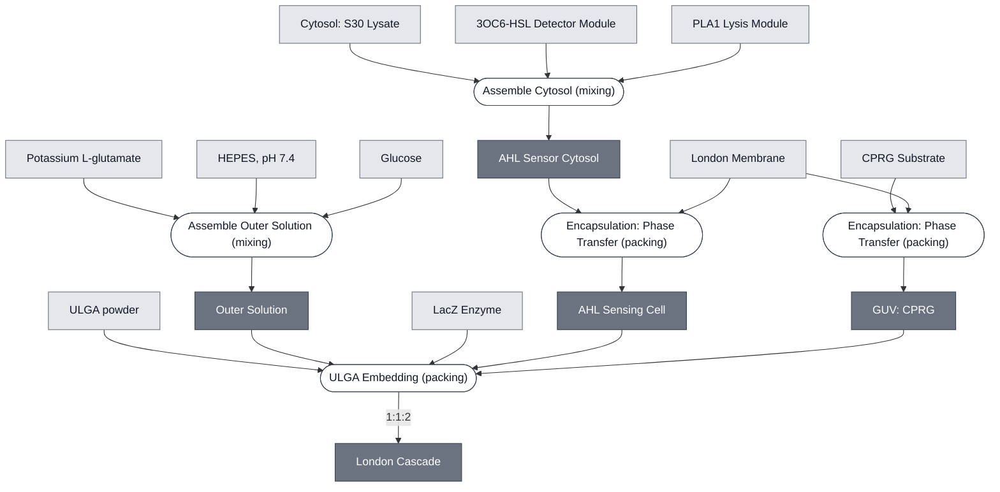

# London Cascade — composition

The London twin of `20260910-chicago-cascade-composition`, in the house greyscale. Boxes are
Modules, stadiums are the Processes that combine them, and each process carries its operator —
*mixing* into one compartment, *packing* into separate ones.

Light boxes are things you obtain, dark boxes are things a process makes. Rendered at depth 1:
anything obtainable is a leaf, so Base Cytosol appears whole rather than expanded. For the
expansion see `london-cascade-composition-deep`.

Generated 2026-09-13 from `docs/modules/london-cascade/spec.yml` by
`scripts/render-composition.py --depth 1`. It supersedes `london-module-dependencies`, which was
built by `gen-subsystem-tree.py` from the prose bullet list and therefore carries no processes
at all.

