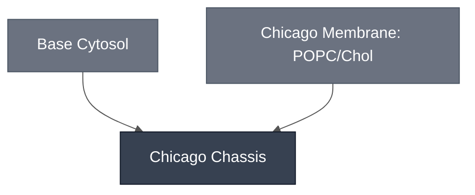

<!-- gen:composition-diagram -->
(fig:chicago-deps)=

```mermaid
%%{init: {'theme': 'base', 'themeVariables': {'lineColor': '#555555', 'edgeLabelBackground': '#ffffff'}}}%%
flowchart TD
    BASE_CYTOSOL["Base Cytosol"]
    CHICAGO_CHASSIS["Chicago Chassis"]
    MEMBRANE_POPC_CHOL_CHICAGO["Chicago Membrane: POPC/Chol"]

    BASE_CYTOSOL --> CHICAGO_CHASSIS
    MEMBRANE_POPC_CHOL_CHICAGO --> CHICAGO_CHASSIS

    classDef constituent fill:#6B7280,color:#ffffff,stroke:#4B5563;
    classDef this fill:#374151,color:#ffffff,stroke:#111827;
    class BASE_CYTOSOL,MEMBRANE_POPC_CHOL_CHICAGO constituent;
    class CHICAGO_CHASSIS this;

    click BASE_CYTOSOL "/docs/modules/base-cytosol/spec"
    click CHICAGO_CHASSIS "/docs/modules/chicago-chassis/spec"
    click MEMBRANE_POPC_CHOL_CHICAGO "/docs/modules/membrane-popc-chol-chicago/spec"
```
*Module dependencies for the Chicago Chassis demonstration.*
<!-- /gen:composition-diagram -->
