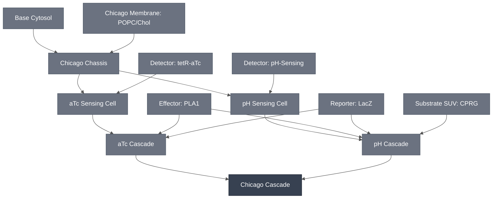

<!-- gen:composition-diagram -->
(fig:chicago-deps)=

```mermaid
%%{init: {'theme': 'base', 'themeVariables': {'lineColor': '#555555', 'edgeLabelBackground': '#ffffff'}}}%%
flowchart TD
    ATC_CASCADE["aTc Cascade"]
    ATC_SENSING_CELL["aTc Sensing Cell"]
    BASE_CYTOSOL["Base Cytosol"]
    CHICAGO_CASCADE["Chicago Cascade"]
    CHICAGO_CHASSIS["Chicago Chassis"]
    DETECTOR_PH["Detector: pH-Sensing"]
    DETECTOR_TETR_ATC["Detector: tetR-aTc"]
    EFFECTOR_PLA1["Effector: PLA1"]
    MEMBRANE_POPC_CHOL_CHICAGO["Chicago Membrane: POPC/Chol"]
    PH_CASCADE["pH Cascade"]
    PH_SENSING_CELL["pH Sensing Cell"]
    REPORTER_LACZ["Reporter: LacZ"]
    SUBSTRATE_CPRG_SUV["Substrate SUV: CPRG"]

    ATC_SENSING_CELL --> ATC_CASCADE
    EFFECTOR_PLA1 --> ATC_CASCADE
    REPORTER_LACZ --> ATC_CASCADE
    CHICAGO_CHASSIS --> ATC_SENSING_CELL
    DETECTOR_TETR_ATC --> ATC_SENSING_CELL
    ATC_CASCADE --> CHICAGO_CASCADE
    PH_CASCADE --> CHICAGO_CASCADE
    BASE_CYTOSOL --> CHICAGO_CHASSIS
    MEMBRANE_POPC_CHOL_CHICAGO --> CHICAGO_CHASSIS
    PH_SENSING_CELL --> PH_CASCADE
    EFFECTOR_PLA1 --> PH_CASCADE
    REPORTER_LACZ --> PH_CASCADE
    SUBSTRATE_CPRG_SUV --> PH_CASCADE
    CHICAGO_CHASSIS --> PH_SENSING_CELL
    DETECTOR_PH --> PH_SENSING_CELL

    classDef constituent fill:#6B7280,color:#ffffff,stroke:#4B5563;
    classDef this fill:#374151,color:#ffffff,stroke:#111827;
    class ATC_CASCADE,ATC_SENSING_CELL,BASE_CYTOSOL,CHICAGO_CHASSIS,DETECTOR_PH,DETECTOR_TETR_ATC,EFFECTOR_PLA1,MEMBRANE_POPC_CHOL_CHICAGO,PH_CASCADE,PH_SENSING_CELL,REPORTER_LACZ,SUBSTRATE_CPRG_SUV constituent;
    class CHICAGO_CASCADE this;
```
*Module dependencies for the Chicago Cascade demonstration.*
<!-- /gen:composition-diagram -->
