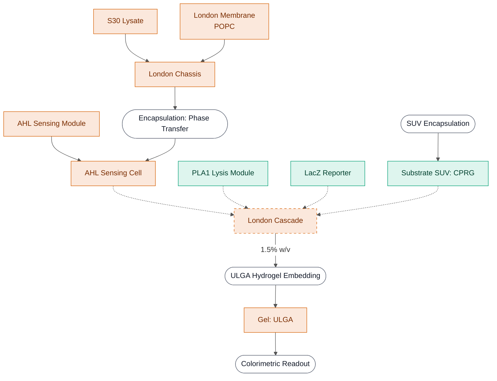

<!-- gen:composition-diagram -->
(fig:london-deps)=

```mermaid
%%{init: {'theme': 'base', 'themeVariables': {'lineColor': '#555555', 'edgeLabelBackground': '#ffffff'}}}%%
flowchart TD
    S30["S30 Lysate"]
    MP["London Membrane<br/>POPC"]
    P_GUV(["Encapsulation: Phase Transfer"])
    P_SUV(["SUV Encapsulation"])
    P_ULGA(["ULGA Hydrogel Embedding"])
    P_READ(["Colorimetric Readout"])
    LON["London Chassis"]
    AHL["AHL Sensing Module"]
    AHLV["AHL Sensing Cell"]
    PLA1["PLA1 Lysis Module"]
    LACZ["LacZ Reporter"]
    SUV["Substrate SUV: CPRG"]
    LONCAS["London Cascade"]
    G_ULGA["Gel: ULGA"]

    S30 --> LON
    MP --> LON
    LON --> P_GUV
    AHL --> AHLV
    P_GUV --> AHLV
    P_SUV --> SUV
    AHLV -.-> LONCAS
    PLA1 -.-> LONCAS
    LACZ -.-> LONCAS
    SUV -.-> LONCAS
    LONCAS -->|"1.5% w/v"| P_ULGA
    P_ULGA --> G_ULGA
    G_ULGA --> P_READ

    classDef london fill:#fbe8dc,stroke:#D55E00,color:#7a2d00;
    classDef shared fill:#def5ee,stroke:#009E73,color:#00402e;
    classDef process fill:#ffffff,stroke:#6b7280,color:#111827;
    class PLA1,LACZ,SUV shared;
    class S30,MP,LON,AHL,AHLV,LONCAS,G_ULGA london;
    class P_GUV,P_SUV,P_ULGA,P_READ process;
    style LONCAS stroke-dasharray: 5 5
```
*Module dependencies for the London Cascade demonstration.*
<!-- /gen:composition-diagram -->
