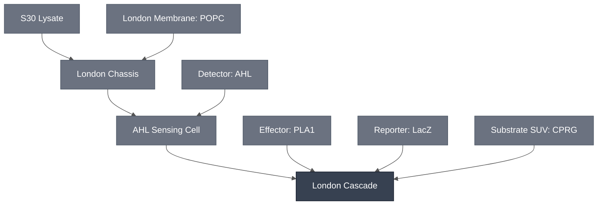

<!-- gen:composition-diagram -->
::::{tab-item} Module Dependencies

(fig:london-deps)=

```mermaid
%%{init: {'theme': 'base', 'themeVariables': {'lineColor': '#555555', 'edgeLabelBackground': '#ffffff'}}}%%
flowchart TD
    AHL_SENSING_CELL["AHL Sensing Cell"]
    DETECTOR_3OC6_HSL["Detector: AHL"]
    EFFECTOR_PLA1["Effector: PLA1"]
    LONDON_CASCADE["London Cascade"]
    LONDON_CHASSIS["London Chassis"]
    MEMBRANE_POPC["London Membrane: POPC"]
    REPORTER_LACZ["Reporter: LacZ"]
    S30_LYSATE["S30 Lysate"]
    SUBSTRATE_CPRG_SUV["Substrate SUV: CPRG"]

    LONDON_CHASSIS --> AHL_SENSING_CELL
    DETECTOR_3OC6_HSL --> AHL_SENSING_CELL
    AHL_SENSING_CELL --> LONDON_CASCADE
    EFFECTOR_PLA1 --> LONDON_CASCADE
    REPORTER_LACZ --> LONDON_CASCADE
    SUBSTRATE_CPRG_SUV --> LONDON_CASCADE
    S30_LYSATE --> LONDON_CHASSIS
    MEMBRANE_POPC --> LONDON_CHASSIS

    classDef constituent fill:#6B7280,color:#ffffff,stroke:#4B5563;
    classDef this fill:#374151,color:#ffffff,stroke:#111827;
    class AHL_SENSING_CELL,DETECTOR_3OC6_HSL,EFFECTOR_PLA1,LONDON_CHASSIS,MEMBRANE_POPC,REPORTER_LACZ,S30_LYSATE,SUBSTRATE_CPRG_SUV constituent;
    class LONDON_CASCADE this;

    click AHL_SENSING_CELL "/docs/modules/ahl-sensing-cell/spec"
    click DETECTOR_3OC6_HSL "/docs/modules/detector-3oc6-hsl/spec"
    click EFFECTOR_PLA1 "/docs/modules/effector-pla1/spec"
    click LONDON_CASCADE "/docs/modules/london-cascade/spec"
    click LONDON_CHASSIS "/docs/modules/london-chassis/spec"
    click MEMBRANE_POPC "/docs/modules/membrane-popc/spec"
    click REPORTER_LACZ "/docs/modules/reporter-lacz/spec"
    click S30_LYSATE "/docs/modules/s30-lysate/spec"
    click SUBSTRATE_CPRG_SUV "/docs/modules/substrate-cprg-suv/spec"
```
*Module dependencies for the London Cascade demonstration.*

::::
<!-- /gen:composition-diagram -->
