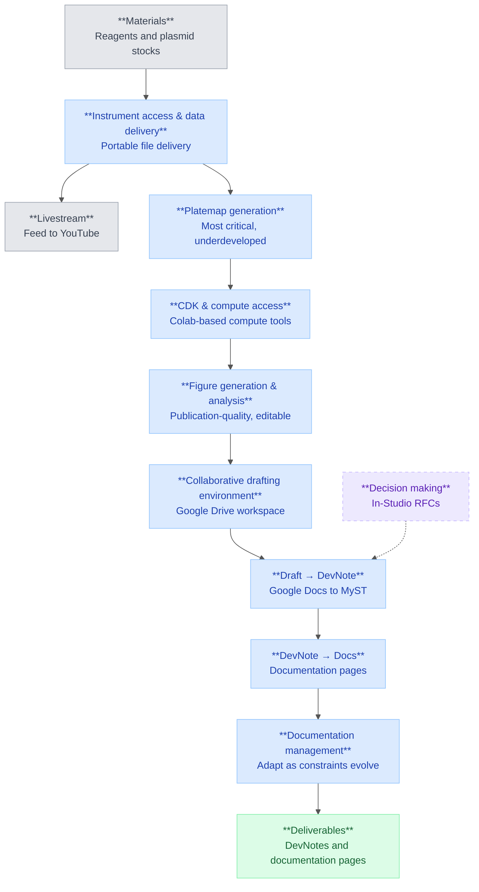

```mermaid
%%{init: {'theme': 'base', 'themeVariables': {'lineColor': '#555555', 'edgeLabelBackground': '#ffffff'}}}%%
flowchart TD
    MATERIALS["**Materials**<br/>Reagents and plasmid stocks"]
    INSTRUMENT["**Instrument access & data delivery**<br/>Portable file delivery"]
    LIVESTREAM["**Livestream**<br/>Feed to YouTube"]
    PLATEMAP["**Platemap generation**<br/>Most critical, underdeveloped"]
    CDK["**CDK & compute access**<br/>Colab-based compute tools"]
    FIGURES["**Figure generation & analysis**<br/>Publication-quality, editable"]
    DRAFTING["**Collaborative drafting environment**<br/>Google Drive workspace"]
    DECISIONS["**Decision making**<br/>In-Studio RFCs"]
    DEVNOTE["**Draft → DevNote**<br/>Google Docs to MyST"]
    DOCS["**DevNote → Docs**<br/>Documentation pages"]
    MGMT["**Documentation management**<br/>Adapt as constraints evolve"]
    DELIVERABLES["**Deliverables**<br/>DevNotes and documentation pages"]

    MATERIALS --> INSTRUMENT
    INSTRUMENT --> LIVESTREAM
    INSTRUMENT --> PLATEMAP
    PLATEMAP --> CDK
    CDK --> FIGURES
    FIGURES --> DRAFTING
    DRAFTING --> DEVNOTE
    DECISIONS -.-> DEVNOTE
    DEVNOTE --> DOCS
    DOCS --> MGMT
    MGMT --> DELIVERABLES

    classDef materials fill:#e5e7eb,color:#374151,stroke:#9ca3af;
    classDef pipeline fill:#dbeafe,color:#1e40af,stroke:#93c5fd;
    classDef side fill:#e5e7eb,color:#374151,stroke:#9ca3af;
    classDef decisions fill:#ede9fe,color:#5b21b6,stroke:#c4b5fd,stroke-dasharray: 5 5;
    classDef deliverables fill:#dcfce7,color:#166534,stroke:#86efac;

    class MATERIALS materials;
    class INSTRUMENT,PLATEMAP,CDK,FIGURES,DRAFTING,DEVNOTE,DOCS,MGMT pipeline;
    class LIVESTREAM side;
    class DECISIONS decisions;
    class DELIVERABLES deliverables;
```
