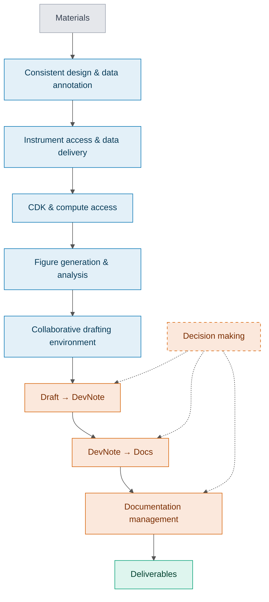

(fig:devstudio-pipeline)=

```mermaid
%%{init: {'theme': 'base', 'themeVariables': {'lineColor': '#555555', 'edgeLabelBackground': '#ffffff'}}}%%
flowchart TD
    MATERIALS["Materials"]
    PLATEMAP["Consistent design & data annotation"]
    INSTRUMENT["Instrument access & data delivery"]
    CDK["CDK & compute access"]
    FIGURES["Figure generation & analysis"]
    DRAFTING["Collaborative drafting environment"]
    DECISIONS["Decision making"]
    DEVNOTE["Draft → DevNote"]
    DOCS["DevNote → Docs"]
    MGMT["Documentation management"]
    DELIVERABLES["Deliverables"]

    MATERIALS --> PLATEMAP
    PLATEMAP --> INSTRUMENT
    INSTRUMENT --> CDK
    CDK --> FIGURES
    FIGURES --> DRAFTING
    DRAFTING --> DEVNOTE
    DECISIONS -.-> DEVNOTE
    DECISIONS -.-> DOCS
    DECISIONS -.-> MGMT
    DEVNOTE --> DOCS
    DOCS --> MGMT
    MGMT --> DELIVERABLES

    classDef materials fill:#e5e7eb,stroke:#9ca3af,color:#374151;
    classDef datapipeline fill:#e3f0f8,stroke:#0072B2,color:#063a57;
    classDef docworkflow fill:#fbe8dc,stroke:#D55E00,color:#7a2d00;
    classDef deliverables fill:#def5ee,stroke:#009E73,color:#00402e;

    class MATERIALS materials;
    class PLATEMAP,INSTRUMENT,CDK,FIGURES,DRAFTING datapipeline;
    class DECISIONS,DEVNOTE,DOCS,MGMT docworkflow;
    class DELIVERABLES deliverables;
    style DECISIONS stroke-dasharray: 5 5
```
*End-to-end pipeline from bench materials through documentation delivery.*
