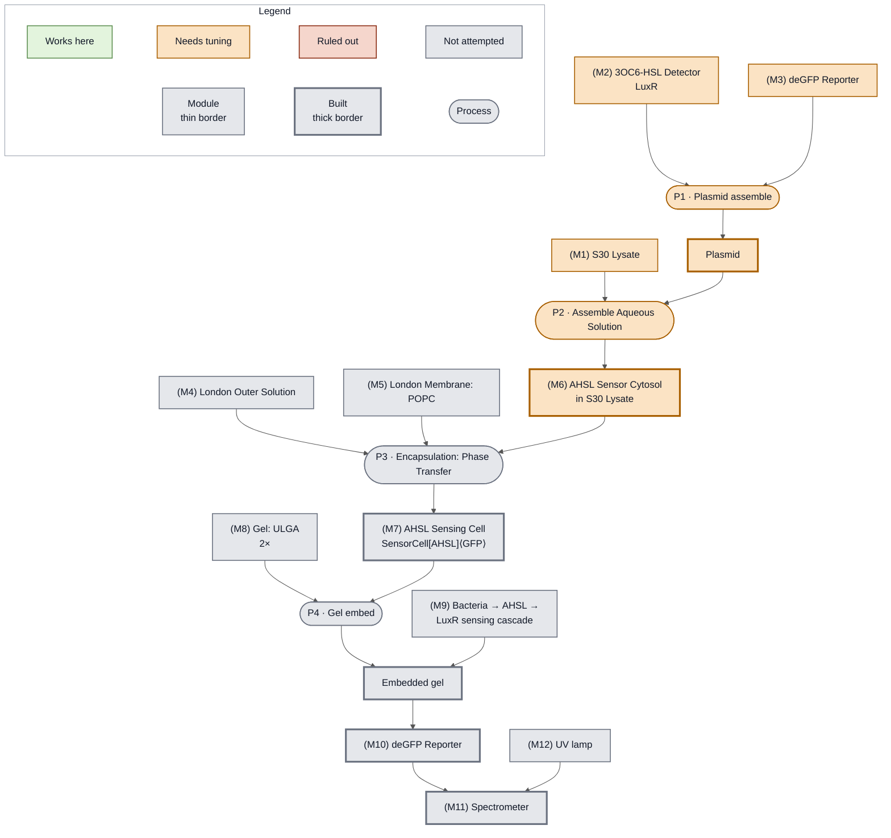

<!-- gen:status-overlay -->
<!-- source: nucleus-eng/devstudio-readiness @ status/week1 : src/20260927-demo-ahl-lysate.md -->
(fig:week1-ahl-lysate)=

*The LuxR-GFP Sensor demonstration detects 3OC6-HSL through LuxR in S30 Lysate and reports it as deGFP fluorescence. Status at the end of Week 1: the sensor chain is orange conservatively, because the dose response ran in Nucleus Cytosol rather than the lysate this figure draws, and no Sensing Cell has been encapsulated.*
<!-- /gen:status-overlay -->
