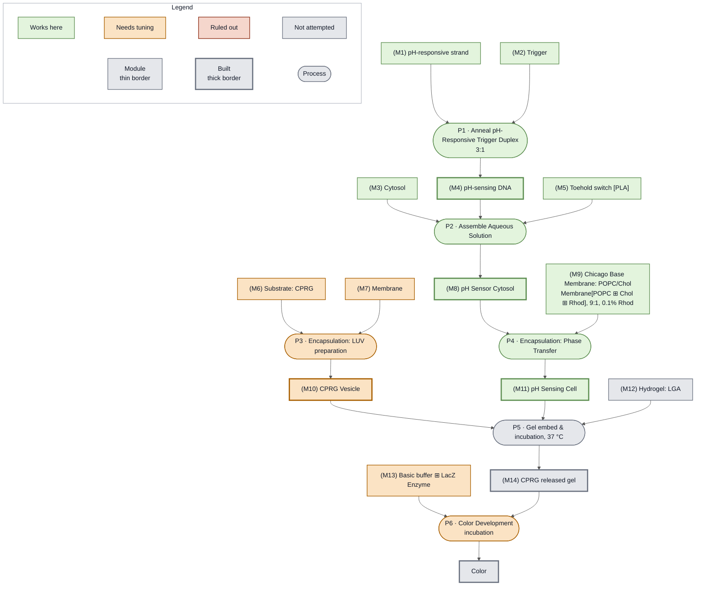

<!-- gen:status-overlay -->
<!-- source: nucleus-eng/devstudio-readiness @ status/week1 : src/20260927-demo-ph.md -->
(fig:week1-ph)=

*The pH Sensing demonstration releases CPRG from a vesicle when low pH opens a toehold switch that expresses PLA1, giving a color read out of a gel. Status at the end of Week 1: the sensing chain through the pH Sensing Cell is green, the CPRG vesicle branch is orange on unresolved leakiness, and no gel has been used for this demonstration.*
<!-- /gen:status-overlay -->
