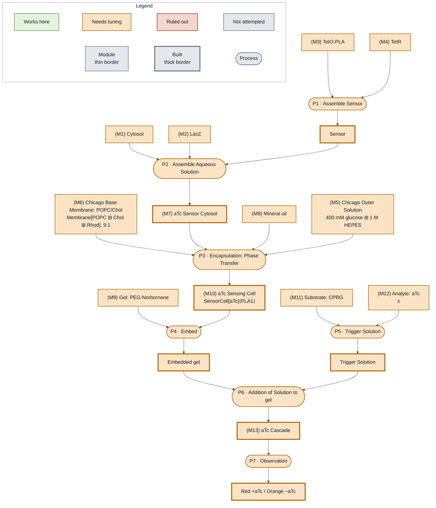

<!-- Status overlay for Week 2, transcribed from the participants' boards. -->
(fig:week2-atc)=

*The aTc Sensor demonstration uses TetR repression of a TetO-PLA construct, so that aTc triggers lysis and a colorimetric readout from a PEG-NB gel. Status at the end of Week 2: every node is orange, with no gray and no green. The demonstration was assembled in full and assayed, and leaky expression of tetO made the readout ambiguous. Compare {ref}`the same board at the end of Week 1 <fig:week1-atc>`.*
