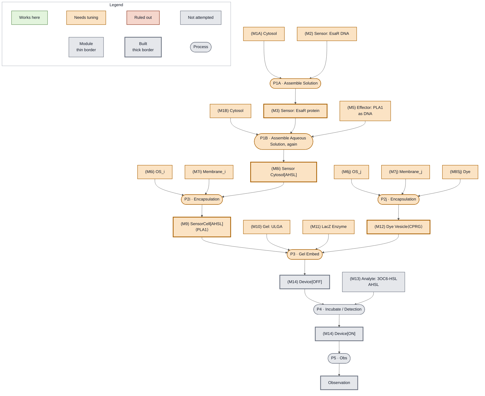

<!-- Status overlay for Week 2, transcribed from the participants' boards. -->
(fig:week2-craic)=

*CRAIC, a Colorimetric Reporter for AHL In Cytosol, detects AHSL through EsaR in Nucleus Cytosol and reports it by releasing CPRG from a dye carrier in a gel. Status at the end of Week 2: gel embedding came off gray on a result borrowed from the Day 9 cross-cutting lysis test, but this demonstration's own device has still never been built, so the device node stays gray. Compare {ref}`the same board at the end of Week 1 <fig:week1-craic>`.*
