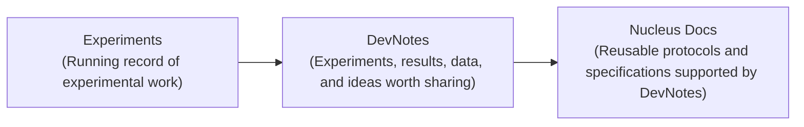

## Overview

Developer Studio (DevStudio) brings together 13 labs, organized into two Nodes, for three weeks of integrated synthetic cell engineering. Over the past nine months, each Node has worked at their home institutions to integrate existing synthetic cell technologies into two demonstrations: the [London](https://devnotes.nucleus.engineering/articles/london-demo-1) and [Chicago](https://devnotes.nucleus.engineering/articles/chicago-demo-1) Demos. DevStudio aims to reproduce this work at Nucleus Labs and document it for reuse, significantly expanding the integrated synthetic cell technologies available through Nucleus as DevNotes and Documentation. More specifically, its goals are:

- Reproduce each Node’s Demo in a new laboratory.
- Document the constituent modules and their dependencies for reuse.
- Improve the tools and workflows that turn experimental work into reusable documentation.

Over the past nine months, the participating labs have been prototyping new approaches to collaborative synthetic cell engineering and developing principles for this emerging field, building on work begun at the [DevCells Kickoff Workshop](https://devnotes.nucleus.engineering/articles/devcells-kickoff-workshop). DevStudio is the capstone of that work: a three-week, co-located effort to reproduce and document the demonstrations on a compressed timeline.

This DevNote is a living account of how b.next, the host of DevStudio, is preparing the infrastructure, materials, and workflows needed to accomplish these goals. It is intended to orient participating labs, collaborators, and visitors; coordinate our preparations; and record technical and organizational lessons for future DevStudios. We will update it as these systems are tested before and during the Studio.

## Synthetic Cell Engineering Infrastructure

Several infrastructure capacities must be in place at b.next-operated Nucleus Labs in order for Developer Studio to accomplish its goals. These capacities are also aligned with those needed to scale the size of collaboration in integrative synthetic cell engineering. This compiles down to three core pieces:

- **Reliable materials:** Reliable materials that support documentation and reusability
- **Data pipelines:** Ability to quickly transform an experimental design into well annotated data
- **Documentation Workflows:** A means for quickly creating and modifying specifications to evolve with emerging constraints

Many of these capacities exist in some form on Nucleus already. However, we need to adapt these tools to accommodate the form of this event and ensure that they work reliably. What follows is a checklist for what needs to be demonstrated and its current status, organized around the pipeline shown in {ref}`pipeline <fig:devstudio-pipeline>`. Module dependencies for each Node's demonstration are shown in {ref}`Chicago <fig:chicago-deps>` and {ref}`London <fig:london-deps>`.

## Capacities checklist

::::{tab-set}
:::{tab-item} Pipeline
```{include} assets/pipeline-diagram.md
```
:::
:::{tab-item} Chicago Module Dependencies
```{include} assets/chicago-module-dependencies.md
```
:::
:::{tab-item} London Module Dependencies
```{include} assets/london-module-dependencies.md
```
:::
::::

In the three weeks leading up to DevStudio, b.next will develop and validate the event’s data and documentation workflows using a representative test case: embedding a base cell in an agarose hydrogel. This rehearsal will exercise both plate-reader and microscopy workflows and test the complete path from experimental design and data collection through analysis, DevNote publication, and incorporation into Nucleus Docs. The goal is to identify and resolve gaps before participants arrive so that these workflows can support the Nodes’ demonstration work during DevStudio.

:::{note}
Beginning the week of September 4, we will update each readiness area below with results from pre-Studio testing, remaining gaps, and next steps. Updates will continue as the workflows are validated and refined.
:::

### Reliable materials

Reproducing the Nodes’ demonstrations requires critical materials to be available and validated before participants arrive. Current preparations include procuring and validating DNA constructs intended for inclusion in the Nucleus Distribution and available under OpenMTA, alongside related reagents produced by b.next—some of which may serve as physical implementations of Nucleus specifications. As validation proceeds, we will update this section with inventory, performance data, known constraints, and readiness status.

:::{table} DNA construct validation status. Full sequences are available in [nucleus-eng/DNA#10](https://github.com/nucleus-eng/DNA/pull/10) and will be merged into the main distribution after DevStudio.
:label: tbl:plasmid-validation
:align: center

| Construct | Design | Order | Amplify & Purify | Test Function | Clone | Notes |
| --- | --- | --- | --- | --- | --- | --- |
| T7-theo-deGFP | Done | Done | Done | Failed | | Not Used for Demo Anymore |
| T7-tetO-deGFP | Done | Done | Done | Done | | |
| T7-tetO-C23DO | Done | Done | Done | Done | | |
| T7-toehold9-PLA1 | Done | Done | Done | | Not required | |
| T7-toehold9-deGFP | Done | Done | Done | Done | Not required | |
| pLux-deGFP | Done | Done | Done | Failed | | Requires cloning in vector for test of function |
| BBa_J23101-LuxR | Done | Done | Done | Failed | | Requires cloning in vector for test of function |
| LuxR-PLA1 | Done | Done | Done | | | In glycerol stock, pET-Kan vector; Requires cloning in vector for test of function |
| LuxR-deGFP | Done | Done | Done | Failed | | In glycerol stock, pET-Kan vector; Requires cloning in vector for test of function |
| T7-theo-PLA1 | Done | Done | Done | | Not required | Not Used for Demo Anymore |
| T7-theo-lacZ | Done | Done | Done | Done/Leaky | Not required | Not Used for Demo Anymore |
| LuxI plasmid | Done | Done | Not required | | Not required | |
| T7-tetO-PLA1 | Done | Done | Done | | | |
| trigger ssDNA | Done | Done | Not required | | Not required | |
| pH-responsive ssDNA | Done | Done | Not required | | Not required | |
:::

### Data pipeline

Each component below corresponds to a stage in the pipeline ({ref}`pipeline <fig:devstudio-pipeline>`).

- **Instrument access & data delivery.** Instruments at Nucleus Labs currently save measurement data to b.next’s internal file system, which visiting participants cannot access. We therefore need a reliable way to deliver files directly to each Node’s shared workspace as they are generated.
- **Consistent data annotations.** Each experiment requires a structured map connecting every well to its materials, conditions, and controls. Because researchers use different formats and conventions to record this information, we need a simple way to translate their existing layouts into standardized inputs compatible with Nucleus’s CDK tools. This is currently the most critical and least developed component of the pipeline. Generating consistent annotations as experiments are designed and executed will also make the resulting data more reusable, supporting future modeling and AI-enabled workflows.
- **CDK and compute access.** Participants need a reliable, low-friction way to run CDK tools without extensive local setup. The compute environment should be consistent across participants, easy to access, and straightforward for b.next to maintain and update as the workflows evolve.
- **Figure generation and analysis.** Participants require a means to modify the CDK outputs, suggest improvements, and integrate analysis into a collaborative drafting environment.
- **Collaborative drafting environment.** Participants require a shared workspace, likely hosted on Google Drive, for assembling figures and notes into a draft. The draft must follow defined semantic conventions to support downstream parsing.

### Documentation workflows

(fig:devstudio-workflow)=

*DevStudio echoes the Nucleus workflow: experimental work is captured in DevNotes and translated into reusable documentation on Nucleus Docs.*

- **Draft to DevNote.** Participants need to draft collaboratively without learning the technical structure of MyST. The workflow should transform their notes, figures, methods, and links to supporting data into publishable DevNotes while preserving structure, attribution, and connections to the underlying evidence.
- **DevNote to Docs.** DevNotes capture specific experiments and their results, while Nucleus Docs describes reusable modules, protocols, and specifications. We need a workflow for identifying validated content in each DevNote and incorporating it into the appropriate documentation pages while preserving links to the supporting work.
- **Documentation management.** Protocols and specifications will evolve as reproduction attempts reveal new requirements, incompatibilities, and constraints. Documentation must be straightforward to update, with changes propagated across related module and process pages and their supporting evidence retained.
- **Decision making.** Some technical decisions during DevStudio will not have an obvious answer or owner. We need a lightweight process for framing these questions, gathering input from relevant experts, recording the evidence and alternatives considered, and publishing the resulting decision—potentially as an RFC-style DevNote.

## Structure of the event

As a starting point, we expect that the event will have the following week-by-week structure.

- **Week 1.** Replicate and test individual modules — get what worked at the home labs working in San Francisco.
- **Week 2.** Resolve issues and get each Node's full integrated demo working.
- **Week 3.** Make another attempt if needed; otherwise, integrate or swap modules across Nodes.

## Follow along

DevStudio will be open to visitors and remote followers from September 23 to October 14. Throughout the three weeks, we will publish and update DevNotes documenting experimental progress, data, and decisions. Reusable protocols and specifications emerging from this work will be incorporated into new documentation pages on Nucleus Docs.

We may even bring back the Nucleus Engineering livestream for selected experiments, offering another way to engage with live data—as it has during past events at Nucleus Labs. Please reach out if you’d like to learn more, visit, or follow along remotely.

::::{iframe} https://www.youtube.com/embed/WPd8dyNlvqk
A previous workshop stream gives a taste of what live instrument output looks like in practice.
::::
