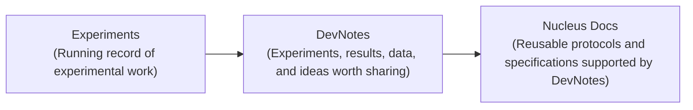

## Overview

Developer Studio (DevStudio) brings together 13 labs, organized into two Nodes, for three weeks of integrated synthetic cell engineering. Over the past nine months, each Node has worked at their home institutions to integrate existing synthetic cell technologies into two demonstrations: the [London](https://devnotes.nucleus.engineering/articles/london-demo-1) and [Chicago](https://devnotes.nucleus.engineering/articles/chicago-demo-1) Demos. DevStudio aims to reproduce this work at Nucleus Labs and document it for reuse, significantly expanding the integrated synthetic cell technologies available through Nucleus as DevNotes and Documentation. More specifically, its goals are:

- Reproduce each Node’s Demo in a new laboratory.
- Document the constituent modules and their dependencies for reuse.
- Improve the tools and workflows that turn experimental work into reusable documentation.

Over the past nine months, the participating labs have been prototyping new approaches to collaborative synthetic cell engineering and developing principles for this emerging field, building on work begun at the [DevCells Kickoff Workshop](https://devnotes.nucleus.engineering/articles/devcells-kickoff-workshop). DevStudio is the capstone of that work: a three-week, co-located effort to reproduce and document the demonstrations on a compressed timeline.

This DevNote is a living account describing process of preparing the infrastructure, materials, and workflows needed to accomplish these goals. It is intended to orient participating labs, collaborators, and visitors; coordinate technical development and tool building; and record technical and organizational lessons for future DevStudios. This document will be updated as these systems are tested before and during the Studio.

## Synthetic Cell Engineering Infrastructure

Several infrastructure capacities must be in place at Nucleus Labs in order for Developer Studio to accomplish its goals. These capacities are also aligned with those needed to scale the size of collaboration in integrative synthetic cell engineering. This compiles down to three core pieces:

- **Reliable materials:** Reliable materials that support documentation and reusability
- **Data pipelines:** Ability to quickly transform an experimental design into well annotated data
- **Documentation Workflows:** A means for quickly creating and modifying specifications to evolve with emerging constraints

Many of these capacities exist in some form on Nucleus already. However, existing tools need to be adapted to accommodate the form of this event and ensure that they work reliably. What follows is a checklist for what needs to be demonstrated and its current status, organized around the pipeline shown in {ref}`pipeline <fig:devstudio-pipeline>`. Module dependencies for each Node's demonstration are shown in {ref}`Chicago <fig:chicago-deps>` and {ref}`London <fig:london-deps>`. The reference chassis for both demonstrations is the [Nucleus Cytosol](https://docs.nucleus.engineering/docs/modules/base-cytosol/spec/), a standardized, open formulation for validating and integrating modules across Nodes.

## Capacities checklist

::::{tab-set}
:::{tab-item} Pipeline
```{include} assets/pipeline-diagram.md
```
:::
:::{tab-item} Chicago Module Dependencies
```{include} assets/chicago-module-dependencies.md
```
:::
:::{tab-item} London Module Dependencies
```{include} assets/london-module-dependencies.md
```
:::
::::

In the three weeks leading up to DevStudio, the event's data and documentation workflows will be developed and validated using a representative test case: embedding a base cell in an agarose hydrogel. This rehearsal will exercise both platereader and microscopy workflows and test the complete path from experimental design and data collection through analysis, DevNote publication, and incorporation into Nucleus Docs. The goal is to identify and resolve gaps before participants arrive so that these workflows can support the Nodes’ demonstration work during DevStudio.

:::{note}

This section will be updated beginning the week of September 4 with results from pre-Studio testing, remaining gaps, and next steps. Updates will continue as the workflows are validated and refined.
:::

What follows is organized around the three areas of the pipeline ({ref}`pipeline <fig:devstudio-pipeline>`): reliable materials that underpin each experiment, the data pipeline from experimental design to annotated figures, and the documentation workflows that turn results into published DevNotes and reusable Nucleus Docs.

### Reliable materials

Reproducing the Nodes’ demonstrations requires critical materials to be available and validated before participants arrive. Current preparations include procuring and validating DNA constructs intended for inclusion in the Nucleus Distribution and available under OpenMTA, alongside custom reagents -  some of which may serve as physical implementations of Nucleus specifications. This section will be updated with inventory, performance data, known constraints, and readiness status as work progresses.

:::{table} DNA construct validation status. Full sequences are available in [nucleus-eng/DNA#10](https://github.com/nucleus-eng/DNA/pull/10) and will be merged into the main distribution after DevStudio.
:label: tbl:plasmid-validation
:align: center

| Construct | Design | Order | Amplify & Purify Linear | Test Function of Linear | Clone Linear | Test Function of Plasmid | Notes |
| --- | --- | --- | --- | --- | --- | --- | --- |
| T7-theo-deGFP | Done | Done | Done | Failed | Not required | Not required | Not Used for Demo Anymore |
| T7-tetO-deGFP | Done | Done | | Done | Not required | Not required | Not Used for Demo |
| T7-tetO-C23DO | Done | Done | Done | Done | Done | | |
| T7-toehold9-PLA1 | Done | Done | Done | | Not required | Not required | |
| T7-toehold9-deGFP | Done | Done | Done | Done | Not required | Not required | |
| pLux-deGFP | Done | Done | Done | Failed | Not required | Not required | Requires cloning in vector for test of function |
| BBa_J23101-LuxR | Done | Done | Done | Failed | Not required | Not required | Requires cloning in vector for test of function |
| LuxR-PLA1 | Done | Done | Done | | Done | | In glycerol stock, pET-Kan vector; Requires cloning in vector for test of function |
| LuxR-deGFP | Done | Done | Done | Failed | Done | | In glycerol stock, pET-Kan vector; Requires cloning in vector for test of function |
| T7-theo-PLA1 | Done | Done | Done | Not required | Not required | Not required | Not Used for Demo Anymore |
| T7-theo-lacZ | Done | Done | Done | Done/Leaky | Not required | Not required | Not Used for Demo Anymore |
| LuxI plasmid | Done | Done | Not required | Not required | Not required | | lacUV5-luxI cloned into pUC-IDT-AMP vector and transformed into NEB5a cells |
| T7-tetO-PLA1 | Done | Done | Not required | Done | Done | | |
| trigger ssDNA | Done | Done | Not required | Done | Not required | Not required | |
| pH-responsive ssDNA | Done | Done | Not required | | Not required | Not required | |
:::

### Data pipeline

- **Instrument access & data delivery.** Participants need a reliable way to access instrument data directly from their shared workspace as experiments run. Instruments currently save data to an internal file system not accessible to visiting participants, so what’s needed is a portable mechanism to deliver files as they are generated.
- **Consistent design & data annotation.** Each experiment requires a structured map connecting every well to its materials, conditions, and controls. Because researchers use different formats and conventions to record this information, what's needed is a simple way to translate their existing layouts into standardized inputs compatible with Nucleus’s CDK tools. This is currently the most critical and least developed component of the pipeline. Generating consistent annotations as experiments are designed and executed will also make the resulting data more reusable, supporting future modeling and AI-enabled workflows.
- **CDK and compute access.** Participants need a reliable, low-friction way to run CDK tools without extensive local setup. The compute environment should be consistent across participants, easy to access, and straightforward for event organizers to maintain and update as the workflows evolve.
- **Figure generation and analysis.** Participants require a means to modify the CDK outputs, suggest improvements, and integrate analysis into a collaborative drafting environment.
- **Collaborative log.** Participants require a shared workspace, likely hosted on Google Drive, for assembling figures, notes, and methods into a running log. The log must follow defined semantic conventions to support downstream parsing into a DevNote.

### Documentation workflows

(fig:devstudio-workflow)=

*DevStudio echoes the Nucleus workflow: experimental work is captured in DevNotes and translated into reusable documentation on Nucleus Docs.*

- **Log to DevNote.** Participants need to log work collaboratively without learning the technical structure of MyST. The workflow should transform their log entries—notes, figures, methods, and links to supporting data—into publishable DevNotes while preserving structure, attribution, and connections to the underlying evidence.
- **DevNote to Docs.** DevNotes capture specific experiments and their results, while Nucleus Docs describes reusable modules, protocols, and specifications. A workflow is needed for identifying validated content in each DevNote and incorporating it into the appropriate documentation pages while preserving links to the supporting work.
- **Documentation management.** Protocols and specifications will evolve as reproduction attempts reveal new requirements, incompatibilities, and constraints. Documentation must be straightforward to update, with changes propagated across related module and process pages and their supporting evidence retained.
- **Decision making.** Some technical decisions during DevStudio will not have an obvious answer or owner. A lightweight process is needed for framing these questions, gathering input from relevant experts, recording the evidence and alternatives considered, and publishing the resulting decision—potentially as an RFC-style DevNote.

## Structure of the event

DevStudio will combine experimental work with a lightweight coordination and documentation cadence. Each day will begin with a brief stand-up to align on planned experiments, dependencies, and blockers. Participants will also have protected time to update shared logs and DevNotes while details are fresh. Regular cross-Node sessions will provide space to compare results, share lessons, discuss documentation practices, and work through technical decisions that affect multiple teams.

Within that cadence, the three weeks will progress from orientation and reproduction to integration, validation, and reuse:

- **Week 0: Prepare before arrival.** Each Node will confirm its module list and the DevNotes it plans to produce during the Studio, attempt an end-to-end integration of its demonstration or identify the key challenges standing in the way, plan its first experiments, and communicate those plans to the broader group before arriving in San Francisco. Participants should also bring lab notes, data, and reference materials for their modules.
- **Week 1: Orient, strategize, and reproduce individual modules.** Each Node will orient to the shared data and documentation workflows and working practices of the Studio—including updates to tools and workflows since the [DevCells Kickoff Workshop](https://devnotes.nucleus.engineering/articles/devcells-kickoff-workshop)—align on its experimental strategy and responsibilities, and establish its individual modules using the materials, equipment, and processes available at Nucleus Labs. Methods, annotated data, deviations, and unresolved gaps will be captured in shared logs and initial DevNotes. By the end of Week 1, teams should have a clear picture of which modules are ready to proceed and, where needed, identify functionally equivalent alternatives so that integration in Week 2 can move forward.
- **Week 2: Resolve integration and reproduce the full demonstration.** Building on the integration attempts and challenges identified before arrival, teams will work through the remaining interfaces and incompatibilities between modules and reproduce each Node’s complete end-to-end demonstration. DevNotes will be updated with integration results, constraints, and technical decisions, while stable protocols and specifications begin moving into Nucleus Docs.
- **Week 3: Validate, document, and consolidate.** Starting from wherever Week 2 left off, teams document the current state of their demonstration—recording what works, what remains unresolved, and what the next steps are. Where demonstrations are running reliably, teams will repeat them to assess reproducibility and, where readiness allows, exchange or recombine modules across Nodes. DevNotes will be completed and Nucleus Docs updated to reflect validated methods, known constraints, and open questions.

## Participants

*Announced soon*

## Acknowledgements

We thank Schmidt Sciences for their generous support of the [Developer Cells Project](https://syncellwiki.org/wiki/index.php/Schmidt_Sciences_DevCell_Project).
