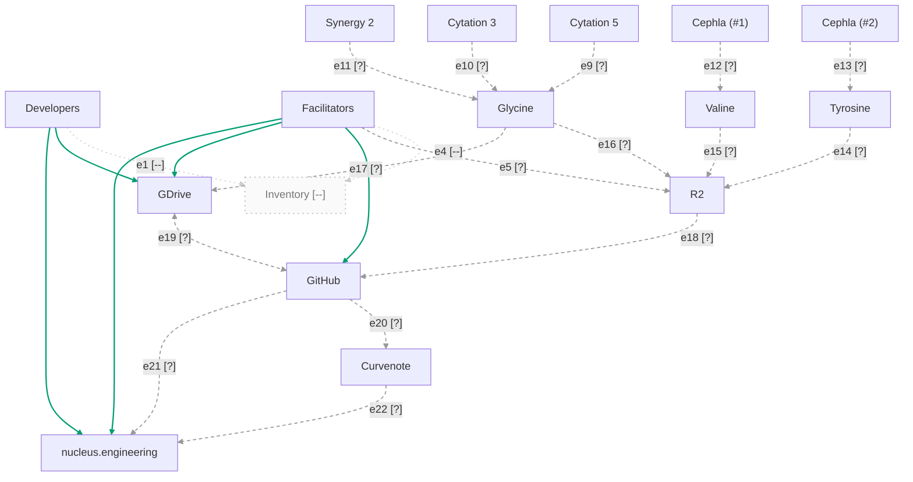

# Data Flow

Conformed to the `mermaid-diagrams` skill on 2026-09-13, and every box links to its entry
under [Locations](#locations).

Most arrows carry an ID (`e1`, `e2`, ...) and a status glyph. Arrows that
are known working are not labelled, because there is nothing to test.
See [Arrow status](#arrow-status) for the status of each one.

## Legend

| Glyph | Status | Line | Meaning |
|---|---|---|---|
| [ok] | Working | Bluish-green, solid | Tested end to end. It works. |
| [x] | Broken | Vermillion, thick | The connection exists but fails. |
| [?] | Needs testing | Grey, dashed | Built, but nobody has confirmed it. |
| [--] | Missing | Faint, dotted | Not built yet. |

## Arrow status

| ID  | From         | To                  | Status | Test | Notes                         |
|-----|--------------|---------------------|--------|------|-------------------------------|
| e1  | Developers   | Inventory           | [--]   |      | Inventory does not exist yet. |
| e2  | Developers   | GDrive              | [ok]   |      | Working. No label on diagram. |
| e3  | Developers   | nucleus.engineering | [ok]   |      | Working. No label on diagram. |
| e4  | Facilitators | Inventory           | [--]   |      | Inventory does not exist yet. |
| e5  | Facilitators | R2                  | [?]    |      |                               |
| e6  | Facilitators | GitHub              | [ok]   |      | Working. No label on diagram. |
| e7  | Facilitators | GDrive              | [ok]   |      | Working. No label on diagram. |
| e8  | Facilitators | nucleus.engineering | [ok]   |      | Working. No label on diagram. |
| e9  | Cytation 5   | Glycine             | [?]    |      |                               |
| e10 | Cytation 3   | Glycine             | [?]    |      |                               |
| e11 | Synergy 2    | Glycine             | [?]    |      |                               |
| e12 | Cephla (#1)  | Valine              | [?]    |      |                               |
| e13 | Cephla (#2)  | Tyrosine            | [?]    |      |                               |
| e14 | Tyrosine     | R2                  | [?]    |      |                               |
| e15 | Valine       | R2                  | [?]    |      |                               |
| e16 | Glycine      | R2                  | [?]    |      |                               |
| e17 | Glycine      | GDrive              | [?]    |      |                               |
| e18 | R2           | GitHub              | [?]    |      |                               |
| e19 | GDrive       | GitHub              | [?]    |      | Two-way                       |
| e20 | GitHub       | Curvenote           | [?]    |      |                               |
| e21 | GitHub       | nucleus.engineering | [?]    |      |                               |
| e22 | Curvenote    | nucleus.engineering | [?]    |      |                               |

# Locations

Boxes in the diagram above. Each box links here.

## People

### Developers
DevStudio participants. Reach Inventory, GDrive and the public site.

### Facilitators
b.next staff running the studio. Also reach GitHub and R2.

## Sites

### nucleus.engineering
The public documentation site. Served from GitHub and Curvenote.

### Inventory
**Does not exist yet.** Both edges into it are `[--]`, and the box is drawn dashed for the same
reason.

## Plate readers

### Cytation 5
### Cytation 3
### Synergy 2

All three write to Glycine.

## Microscopes

### Cephla 1
### Cephla 2

Cephla 1 writes to Valine; Cephla 2 to Tyrosine.

## Acquisition computers

### Glycine
Plate-reader acquisition. The only computer that writes to both R2 and GDrive.

### Tyrosine
### Valine
Microscopy acquisition. Both write to R2 only.

## Servers

### R2
Object storage. Receives from all three acquisition computers, pushes to GitHub.

### GDrive
The DevStudio working surface. See `document-workflow` for what happens inside it.

### GitHub
`nucleus-docs` and the DevNote archive. See `document-workflow`.

### Curvenote
Renders and serves DevNotes to the public site.

# What the skill could not settle

`mermaid-diagrams` defines status with **edge syntax** — `-->` confirmed, `-.->` proposed,
`--x` blocked. Three states. This diagram uses **classDef styling** for four, and its sibling
`document-workflow` now uses six. Converting to the skill's three would lose the distinction
between *needs testing* and *not built*, which is most of what these diagrams are for.

**So the skill has no convention for this genre**, and the readiness README already says so:
*"The two demo diagrams use a different convention… Two legends in the room."* What was applied
here is everything that does transfer — fence form, `UPPER_SNAKE` ids, a colourblind-safe
palette with redundant line-style encoding, a standalone legend, and `click` targets. What was
not is the status vocabulary, deliberately.

**Worth raising** when the `style-guide` skill lands: a status-diagram convention belongs
somewhere, and right now it lives only in these two files and the README.
