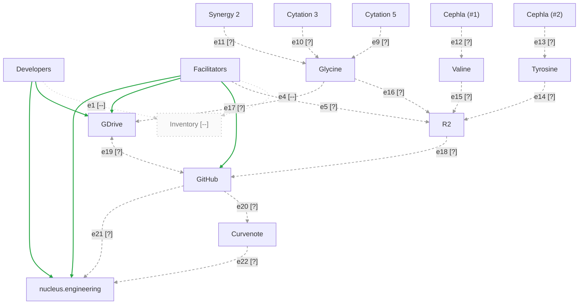

# Data Flow

@Claude: format using standards in nucleus-skills; link to headers in this doc

Most arrows carry an ID (`e1`, `e2`, ...) and a status glyph. Arrows that
are known working are not labelled, because there is nothing to test.
See [Arrow status](#arrow-status) for the status of each one.

## Legend

| Glyph | Status | Line | Meaning |
|---|---|---|---|
| [ok] | Working | Green, solid | Tested end to end. It works. |
| [x] | Broken | Red, thick | The connection exists but fails. |
| [?] | Needs testing | Grey, dashed | Built, but nobody has confirmed it. |
| [--] | Missing | Faint, dotted | Not built yet. |

## Arrow status

| ID  | From         | To                  | Status | Test | Notes                         |
|-----|--------------|---------------------|--------|------|-------------------------------|
| e1  | Developers   | Inventory           | [--]   |      | Inventory does not exist yet. |
| e2  | Developers   | GDrive              | [ok]   |      | Working. No label on diagram. |
| e3  | Developers   | nucleus.engineering | [ok]   |      | Working. No label on diagram. |
| e4  | Facilitators | Inventory           | [--]   |      | Inventory does not exist yet. |
| e5  | Facilitators | R2                  | [?]    |      |                               |
| e6  | Facilitators | GitHub              | [ok]   |      | Working. No label on diagram. |
| e7  | Facilitators | GDrive              | [ok]   |      | Working. No label on diagram. |
| e8  | Facilitators | nucleus.engineering | [ok]   |      | Working. No label on diagram. |
| e9  | Cytation 5   | Glycine             | [?]    |      |                               |
| e10 | Cytation 3   | Glycine             | [?]    |      |                               |
| e11 | Synergy 2    | Glycine             | [?]    |      |                               |
| e12 | Cephla (#1)  | Valine              | [?]    |      |                               |
| e13 | Cephla (#2)  | Tyrosine            | [?]    |      |                               |
| e14 | Tyrosine     | R2                  | [?]    |      |                               |
| e15 | Valine       | R2                  | [?]    |      |                               |
| e16 | Glycine      | R2                  | [?]    |      |                               |
| e17 | Glycine      | GDrive              | [?]    |      |                               |
| e18 | R2           | GitHub              | [?]    |      |                               |
| e19 | GDrive       | GitHub              | [?]    |      | Two-way                       |
| e20 | GitHub       | Curvenote           | [?]    |      |                               |
| e21 | GitHub       | nucleus.engineering | [?]    |      |                               |
| e22 | Curvenote    | nucleus.engineering | [?]    |      |                               |
