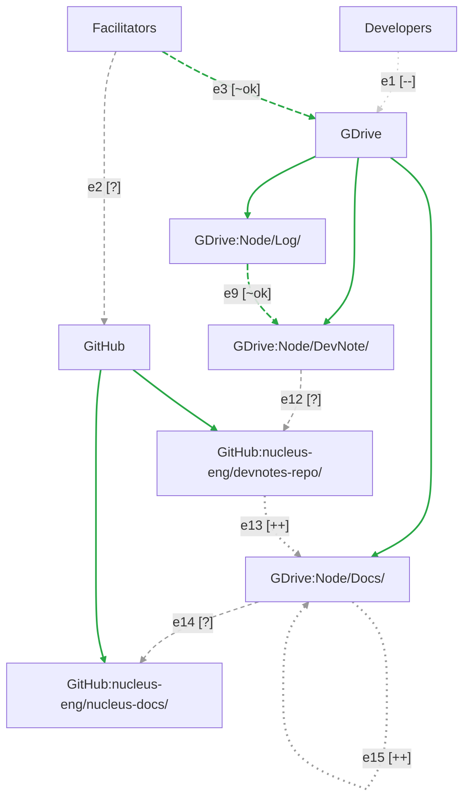

# Document Workflow

This document represents our workflow for documenting the DevStudio. 

Most arrows carry an ID (`e1`, `e2`, ...) and a status glyph. Arrows that only show
structure — what sits inside what — are not labelled, because there is no step to test.
See [Arrow status](#arrow-status) for the status of each one.

## Legend

| Glyph | Status | Line | Meaning |
|---|---|---|---|
| [ok] | Working | Green, solid | Tested end to end. It works. |
| [~ok] | Working, needs refinement | Green, dashed | It works end to end. A known gap remains. |
| [x] | Broken | Red, thick | The connection exists but fails. |
| [?] | Needs testing | Grey, dashed | Built, but nobody has confirmed it. |
| [++] | Missing, hard | Grey, heavy dotted | Not built. Real work, not yet begun. |
| [--] | Missing, easy | Faint, dotted | Not built. A known, small job. |

## Arrow status

| ID | From | To | Status | Skill | Notes |
|---|---|---|---|---|---|
| e1 | Developers | GDrive | [--] | — | Drive invitations only, scheduled for the participants' first week. Unstarted and small. **Day-one item.** |
| e2 | Facilitators | GitHub | [?] | [submit-to-github](https://github.com/nucleus-eng/nucleus-skills/blob/devstudio-skills/plugins/nucleus/skills/devstudio-submit-to-github/SKILL.md) | Repo access only; the Claude-authorization question moved to e3. Auth: Anton Molina, Jon, Surendra (needs training). Anton to confirm Sharon is already added; green only then. Neil is out unless we go wide. |
| e3 | Facilitators | GDrive | [~ok] | [read](https://github.com/nucleus-eng/nucleus-skills/blob/devstudio-skills/plugins/nucleus/skills/devstudio-read-from-google-drive/SKILL.md) · [write](https://github.com/nucleus-eng/nucleus-skills/blob/devstudio-skills/plugins/nucleus/skills/devstudio-write-to-google-drive/SKILL.md) | Read and write both confirmed. Two refinements: Neil's access, expected Monday 2026-09-14; and scoping the Claude agent's OAuth so it cannot see the bnext Drive. The second is not ours alone. |
| e5 | GDrive | Node/Log/ | [ok] | — | Structure, not a step. |
| e6 | GDrive | Node/DevNote/ | [ok] | — | Structure, not a step. |
| e7 | GDrive | Node/Docs/ | [ok] | — | Structure, not a step. |
| e9 | Node/Log/ | Node/DevNote/ | [~ok] | [log-to-devnote-g](https://github.com/nucleus-eng/nucleus-skills/blob/devstudio-skills/plugins/nucleus/skills/devstudio-log-to-devnote-g/SKILL.md) | Four unit tests passed: links parse, tables correct, sections correct, written straight into the DevStudio Drive. **Refinement: two logs into one DevNote, untested.** |
| e12 | Node/DevNote/ | devnotes-repo | [?] | [devnote-g-to-devnote-m](https://github.com/nucleus-eng/nucleus-skills/blob/devstudio-skills/plugins/nucleus/skills/devstudio-devnote-g-to-devnote-m/SKILL.md) · [submit-to-github](https://github.com/nucleus-eng/nucleus-skills/blob/devstudio-skills/plugins/nucleus/skills/devstudio-submit-to-github/SKILL.md) | Drafted, not tested — **in flight, Anton's next step.** The skill's own file says "not yet validated end-to-end". |
| e13 | devnotes-repo | Node/Docs/ | [++] | [author-myst-content](https://github.com/nucleus-eng/nucleus-skills/blob/devstudio-skills/plugins/nucleus/skills/devstudio-author-myst-content/SKILL.md) | Not started. Ruled in on 2026-09-13 against a proposal to route comment-and-review through GitHub instead. Anton takes it after e12. |
| e14 | Node/Docs/ | nucleus-docs | [?] | [author-myst-content](https://github.com/nucleus-eng/nucleus-skills/blob/devstudio-skills/plugins/nucleus/skills/devstudio-author-myst-content/SKILL.md) | Prior art exists, but no docs page has ever been pushed from Google Drive. Part style-guide work. |
| e15 | Node/Docs/ | Node/Docs/ | [++] | `style-guide` | Comment and review. Gates the next step. Designed, not built: Claude writes an append-only report and never edits the human's Doc. |
| e16 | GitHub | devnotes-repo | [ok] | — | Structure, not a step. |
| e17 | GitHub | nucleus-docs | [ok] | — | Structure, not a step. |

**Reviewed 2026-09-13** with Anton Molina. Every unlabelled edge was checked; e13 and e15 were confirmed as work not yet started, not as work that failed.

**Cut 2026-09-12.** `e4` (GDrive ↔ GitHub) — e2 and e3 cover it. `e8` and `e10` — self-loops
on Log and DevNote. `e11` (DevNote → Docs on Drive) — redundant against e13, now that all
Drive content is forced into well-formed DevNotes before documentation is generated.

**Scope.** Only DevNote(M) → Docs(M) is covered: MyST-form DevNote to MyST-form docs.

# Locations
Boxes in diagram above

## Laptops
Designing experiments, personal notes, drafting language, interacting with remainder of workflow.

### Developers
### Facilitators

## Google Drive
Q: what permissions for participants? and how?

### Log
### DevNotes
### Docs

## GitHub
All your bases...

### [nucleus-docs](https://github.com/nucleus-eng/nucleus-docs)
### [nucleus-devnotes](https://github.com/nucleus-eng/nucleus-devnote-archive-1)

# Workflows / Skills
Arrows in diagram above.
