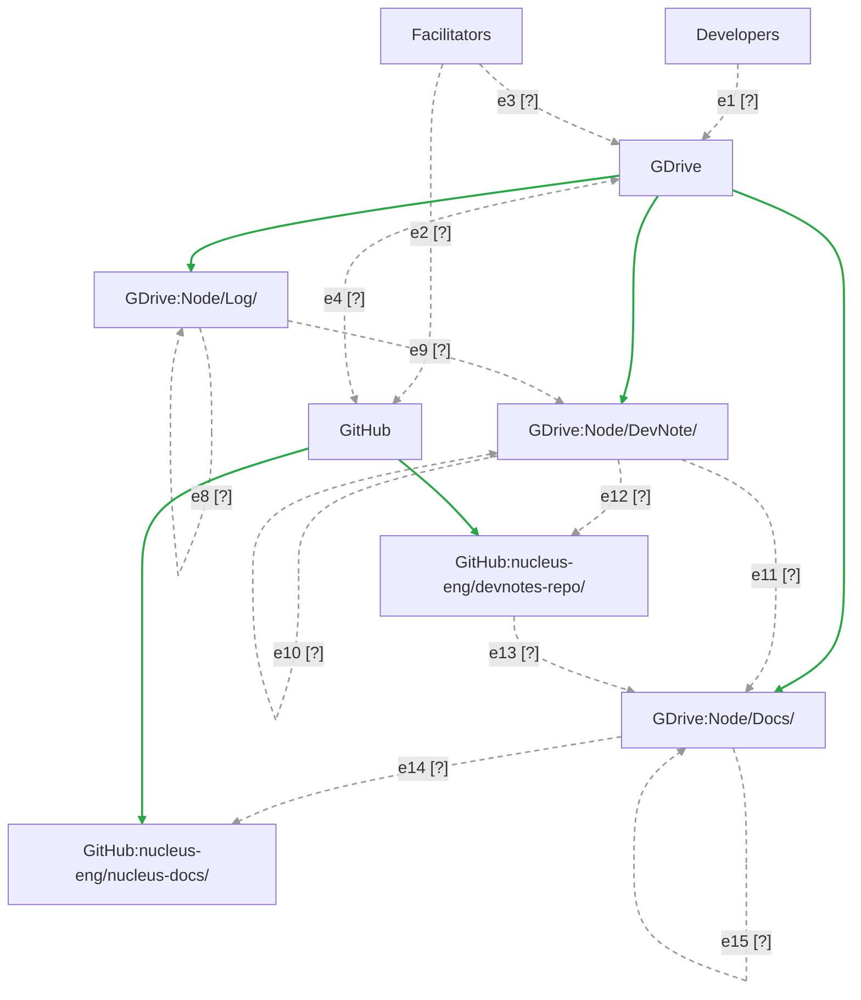

# Document Workflow

This document represents our workflow for documenting the DevStudio. 

Most arrows carry an ID (`e1`, `e2`, ...) and a status glyph. Arrows that
just show containment are not labelled, because there is nothing to test.
See [Arrow status](#arrow-status) for the status of each one.

## Legend

| Glyph | Status | Line | Meaning |
|---|---|---|---|
| [ok] | Working | Green, solid | Tested end to end. It works. |
| [x] | Broken | Red, thick | The connection exists but fails. |
| [?] | Needs testing | Grey, dashed | Built, but nobody has confirmed it. |
| [--] | Missing | Faint, dotted | Not built yet. |

## Arrow status

| ID | From | To | Status | Test | Notes |
|---|---|---|---|---|---|
| e1 | Developers | GDrive | [?] | | |
| e2 | Facilitators | GitHub | [?] | | |
| e3 | Facilitators | GDrive | [?] | | |
| e4 | GDrive | GitHub | [?] | | Two-way |
| e5 | GDrive | Node/Log/ | [ok] | | Containment. No label on diagram. |
| e6 | GDrive | Node/DevNote/ | [ok] | | Containment. No label on diagram. |
| e7 | GDrive | Node/Docs/ | [ok] | | Containment. No label on diagram. |
| e8 | Node/Log/ | Node/Log/ | [?] | | Unclear? ask ARM |
| e9 | Node/Log/ | Node/DevNote/ | [?] | | |
| e10 | Node/DevNote/ | Node/DevNote/ | [?] | | Comment and review. Gates the next step. |
| e11 | Node/DevNote/ | Node/Docs/ | [?] | | |
| e12 | Node/DevNote/ | devnotes-repo | [?] | | |
| e13 | devnotes-repo | Node/Docs/ | [?] | | |
| e14 | Node/Docs/ | nucleus-docs | [?] | | |
| e15 | Node/Docs/ | Node/Docs/ | [?] | | Comment and review. Gates the next step. |
| e16 | GitHub | devnotes-repo | [ok] | | Containment. No label on diagram. |
| e17 | GitHub | nucleus-docs | [ok] | | Containment. No label on diagram. |

# Locations
Boxes in diagram above

## Laptops
Designing experiments, personal notes, drafting language, interacting with remainder of workflow.

### Developers
### Facilitators

## Google Drive
Q: what permissions for participants? and how?

### Log
### DevNotes
### Docs

## GitHub
All your bases...

### [nucleus-docs](https://github.com/nucleus-eng/nucleus-docs)
### [nucleus-devnotes](https://github.com/nucleus-eng/nucleus-devnote-archive-1)

# Workflows / Skills
Arrows in diagram above.
